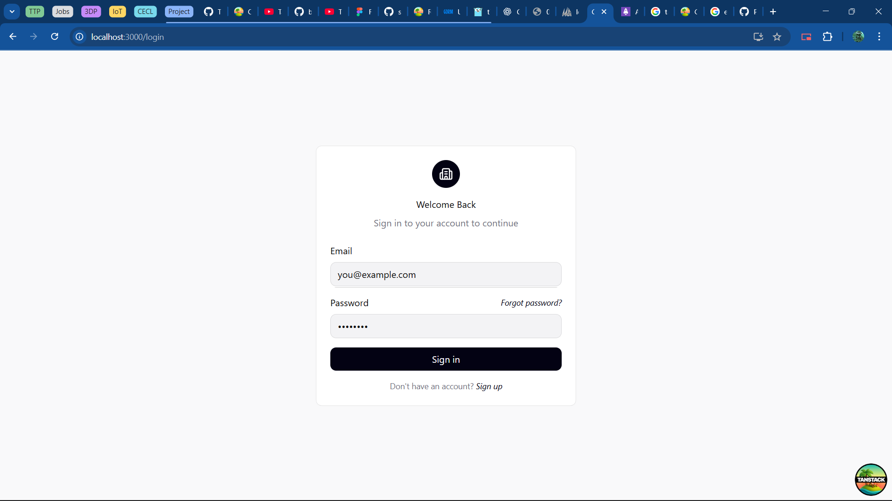
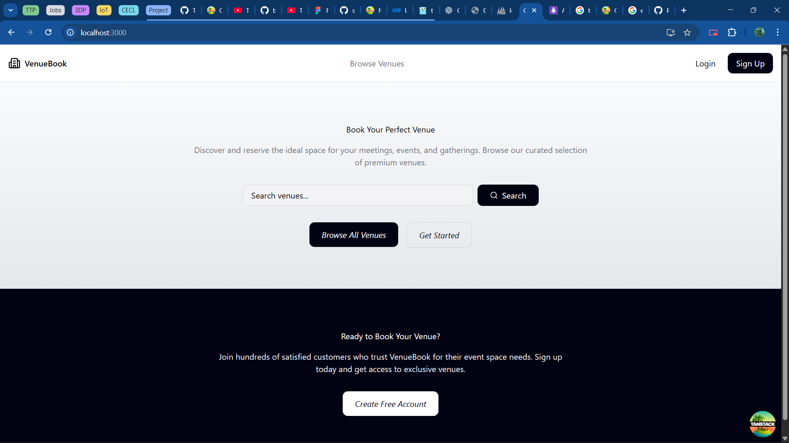
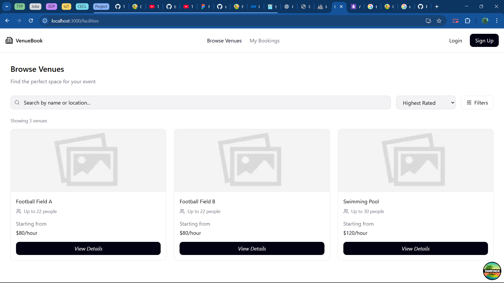
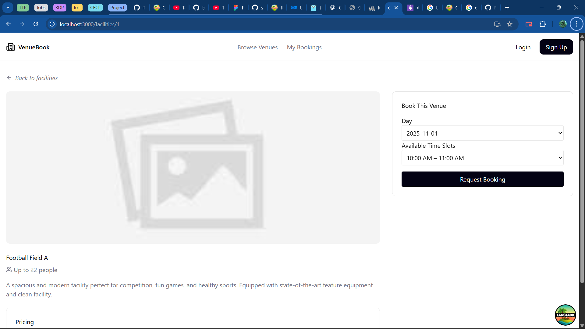
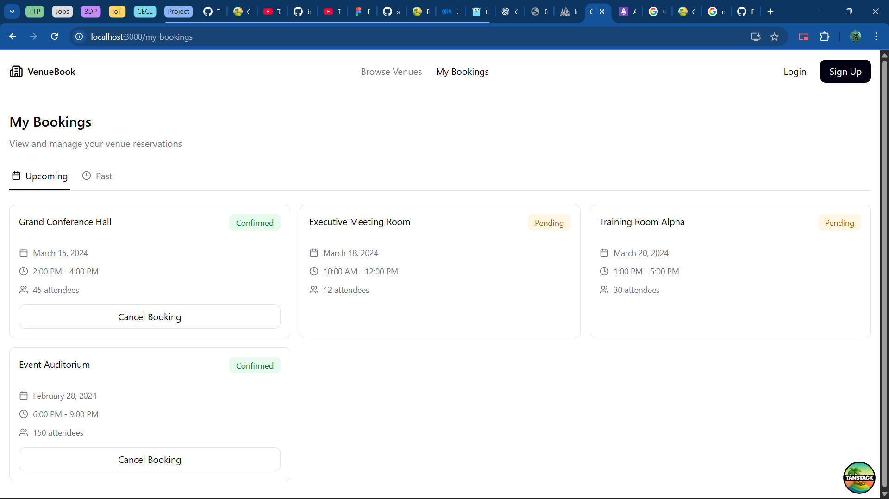

# Bookit (Frontend)

A prototype web application for managing and booking facilities.  
Built with **React**, **TanStack Router**, and **TanStack Query** for smooth routing, data fetching, and state management.

---

##  Features

1. **Facility Browsing**
   - Displays all available facilities with name, description, and image.
   - Fetches data from the Go backend API.

2. **Booking Slots**
   - Users can view time slots for each facility.
   - Selects available slots and calculates total price before booking.

3. **Booking Confirmation**
   - Sends booking request to the backend.
   - Displays booking success or error message.

4. **Profile Management**
   - Allows users to edit their information.
   - Securely interacts with backend authentication routes.

5. **Responsive Design**
   - Fully responsive layout using **Tailwind CSS**.
   - Optimized for mobile and desktop views.

6. **Modern Routing & Fetching**
   - Uses **TanStack Router** for dynamic navigation.
   - **TanStack Query** handles automatic caching and real-time updates.

---

## Image

---

## Tech Stack

- **React + TypeScript**
- **TanStack Router & TanStack Query**
- **Tailwind CSS**
- **Lucide React** (icons)
- **Vite** (development server)
